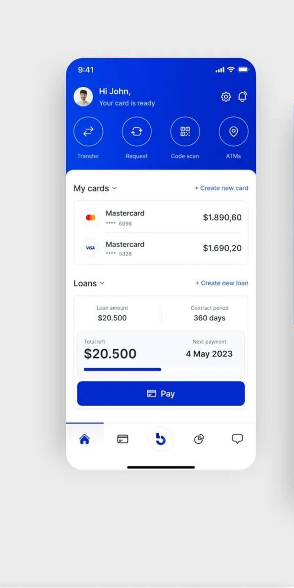
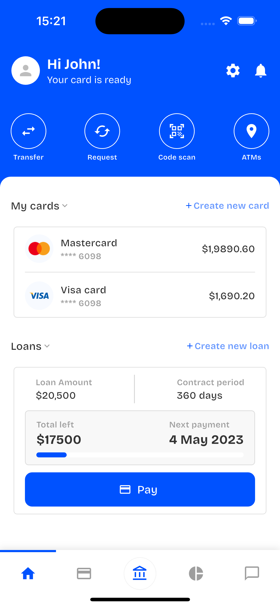

# Woodcore Assessment

A Flutter mobile banking application built as an assessment project, replicating a modern financial app interface with clean architecture and responsive design.

## 📱 Project Overview

This project is a Flutter implementation of a mobile banking application interface. The app features a home dashboard with cards and loans management, along with a bottom navigation system for easy access to different sections.

## 🚀 Getting Started

### Prerequisites

- Flutter SDK: **3.32.1** (channel stable)
- Dart: **3.8.1**
- Android Studio / VS Code with Flutter extensions
- iOS Simulator (for iOS development) / Android Emulator

### Installation & Setup

1. **Clone the repository**
   ```bash
   git clone https://github.com/dejiayodejii/woodcore-assessment.git
   cd woodcore-assessment
   ```

2. **Install dependencies**
   ```bash
   flutter pub get
   ```

3. **Run the application**
   ```bash
   # For development
   flutter run
   
   # For specific platform
   flutter run -d ios
   flutter run -d android
   ```

4. **Build for production**
   ```bash
   # Android
   flutter build apk --release
   
   # iOS
   flutter build ios --release
   ```

## 🏗️ Project Structure

```
lib/
├── core/
│   ├── models/          # Data models (CardModel, LoanModel)
│   └── utils/
│       └── theme/       # App theme, colors, and styling
├── features/
│   ├── bottom_navigation/   # Main navigation logic
│   ├── cards/              # Cards feature (views, viewmodels)
│   ├── home/               # Home screen and widgets
│   ├── loans/              # Loans feature (views, viewmodels)
│   ├── support/            # Support screen
│   └── transactions/       # Transactions screen
└── main.dart
```

## 🎯 Features Implemented

### ✅ Core Features
- **Home Dashboard**: Overview of cards and loans with collapsible sections
- **Bottom Navigation**: 5-tab navigation (Home, Cards, Loans, Transactions, Support)
- **Cards Management**: Display multiple cards with balances
- **Loans Management**: Loan details with progress tracking and payment functionality
- **State Management**: ViewModels using Flutter's ChangeNotifier
- **Responsive Design**: Adapts to different screen sizes

### ✅ UI/UX Features
- **Toggle Sections**: Expandable/collapsible cards and loans sections
- **Loading States**: Shimmer effects and loading indicators
- **Custom Bottom Navigation**: Full-width line indicators for selected tabs
- **Payment Simulation**: Interactive payment processing with progress updates
- **Clean Architecture**: Separation of concerns with ViewModels

## 🎨 Design Implementation

### Original Design vs Implementation

| Original Design | My Implementation |
|----------------|-------------------|
|  |  |

### Design Notes

> **Font Limitation**: Since the exact font used in the original design was not specified and I don't have access to the original design assets, I used Flutter's default system fonts and sourced the closest alternatives available.

> **Asset Images**: The original design contained specific card brand logos and icons. As these assets were not provided, I sourced and used similar publicly available icons and images that closely match the original design aesthetic.


## 🛠️ Technical Implementation

### State Management
- **Pattern**: MVVM (Model-View-ViewModel)
- **Tool**: Flutter's built-in `ChangeNotifier`
- **Benefits**: No external dependencies, reactive UI updates

### Architecture Highlights
- **Clean Separation**: Models, ViewModels, and Views are clearly separated
- **Reusable Components**: Custom widgets for cards, loans, and navigation
- **Mock Data**: Realistic mock data with simulated API calls

### Key ViewModels
- **CardsViewModel**: Manages card data, toggle states, and CRUD operations
- **LoansViewModel**: Handles loan information, payment processing, and progress tracking

## 📱 App Features

### Home Screen
- User greeting and profile avatar
- Quick action buttons (Transfer, Request, Code Scan, ATMs)
- Cards section with multiple card support
- Loans section with payment tracking
- Collapsible sections for better UX

### Navigation
- 5-tab bottom navigation
- Full-width line indicators for active tabs
- Smooth transitions between screens
- Center tab always highlighted (design choice)

### Interactive Elements
- Tap to expand/collapse sections
- Payment simulation with loading states
- Real-time progress bar updates
- Responsive touch targets

## 🔧 Flutter Version & Dependencies

- **Flutter Version**: 3.32.1
- **Dependencies**: Minimal external dependencies, primarily using Flutter's built-in widgets and state management

## 📝 Development Notes

### Challenges & Solutions
1. **Font Matching**: Used system fonts with custom weights to approximate the original design
2. **Asset Recreation**: Sourced similar icons and created custom containers to match the visual style
3. **State Management**: Implemented custom ViewModels without external packages for clean architecture


## 🤝 Contributing

This is an assessment project, but feedback and suggestions are welcome!

## 📄 License

This project is created for assessment purposes.

---

**Note**: This implementation represents my interpretation of the provided design mockup. Where specific assets or fonts were not available, I used the closest alternatives to maintain the overall design aesthetic and user experience.